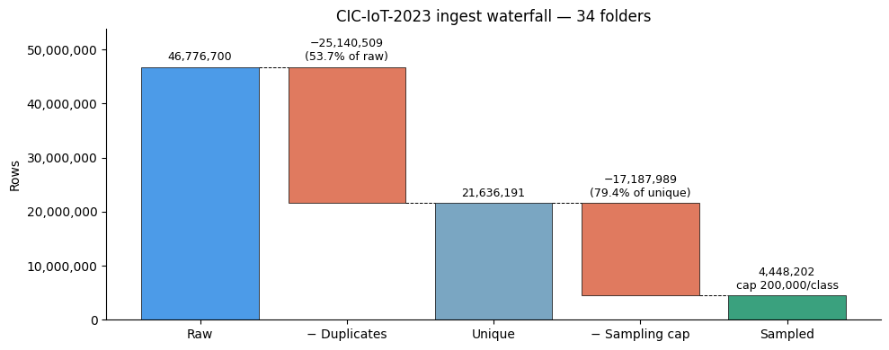
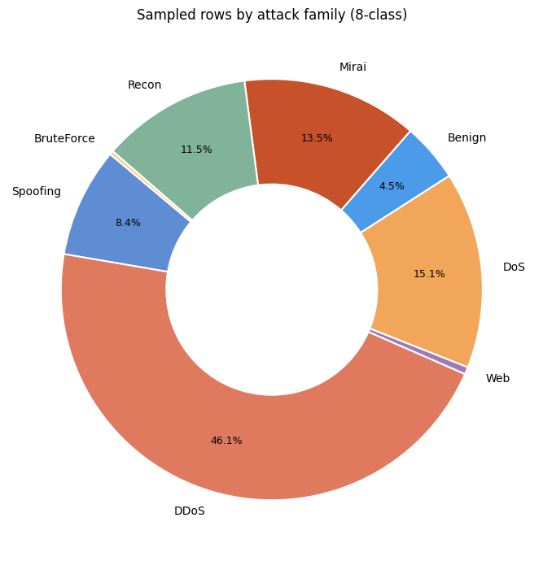
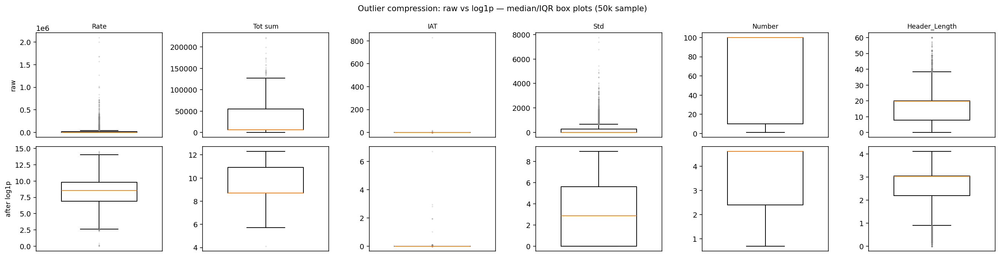
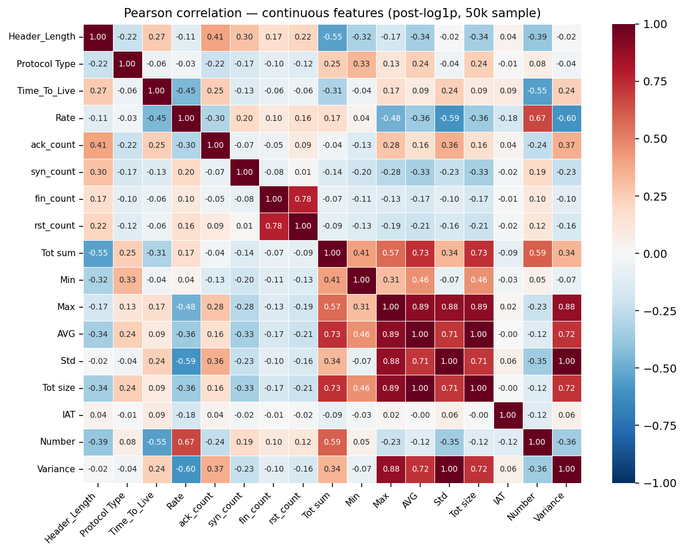
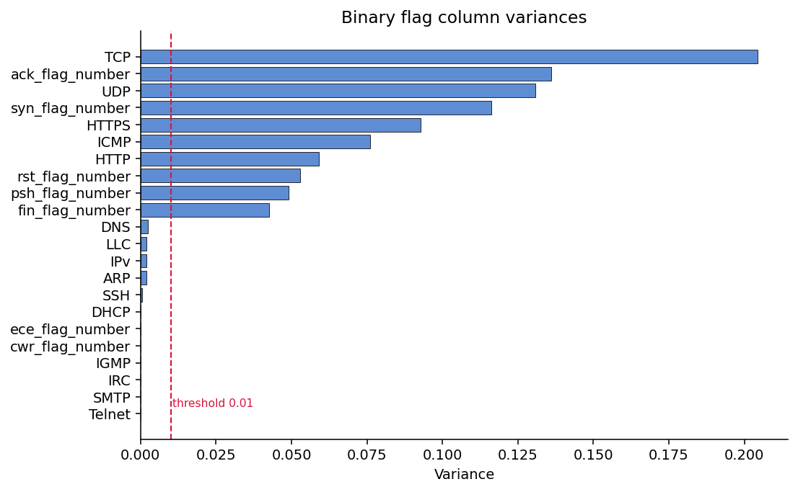
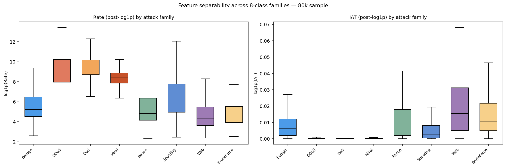
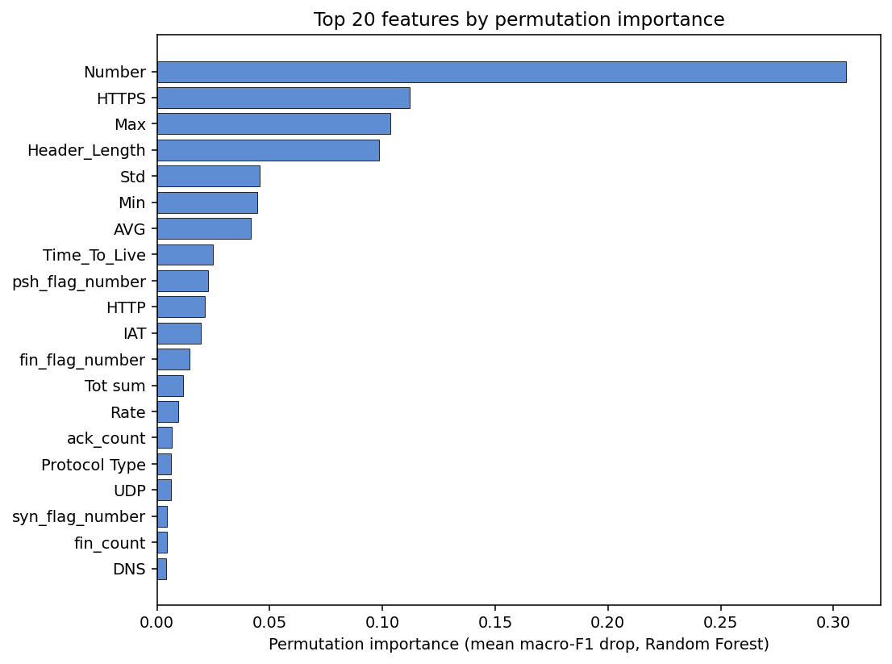

# ML defense — Data Understanding segment

**Purpose:** show command of the dataset — what it is, whether it's clean, the shape of the labels and features, and where the discriminative signal lives. Models and results are presented elsewhere; this segment is *data only*.

**Audience:** thesis committee. **Length:** ~6 slides, 5–7 min (~50s/slide).

**Narrative arc:** what is it → is it clean → what's the label shape → what's each feature's shape → how do features relate → what separates the classes.

**One-line lead-in:** "Before any model, I want to show what kind of data this is — because the data's structure explains almost everything the model later does."

---

## Slide 1 — What this data actually is

**On slide:**
- CIC-IoT-2023 — per-flow **statistics**, not raw packets
- A "flow" = one **packet window** between two hosts (10 packets; 100 for floods), not a full session
- 39 features per flow; 34 labels total = 33 attack types + Benign
- Feature families: rates · byte/packet counts · inter-arrival times · TCP-flag counts · protocol indicators

**Say:**
- "Each row is one network *flow* summarised by 39 numeric statistics — extracted from packet captures, not the packets themselves. So we never see payload, only aggregate behaviour: how fast, how big, how often, with which flags and protocols."
- "And 'flow' here is specific: a short window of consecutive packets between two hosts — 10 packets for most traffic, 100 for the floods — not a full TCP session. That's deliberate: you can classify after just 10 packets without waiting for a connection to close, which is what makes it real-time-friendly."
- "That single fact bounds what's learnable. A flow-statistics model can spot a flood from its rate and timing, but it's structurally blind to what's *inside* an HTTP request — which is exactly why the web-based attacks will be the hard ones. Keep that in mind for the last slide."

**Figure:** none (or a 5-row feature-category list). **Time:** ~45s.

---

## Slide 2 — Scale & data quality

**On slide:**
- 46.8M raw rows
- **53.7% byte-identical duplicates** → removed
- 200k-per-class cap → 4.45M working set

**Say:**
- "The raw release is 46.8 million flow records. The first thing I checked was quality — and over half, 53.7%, are exact byte-for-byte duplicates. That's a documented quirk of this dataset, reported by other authors too."
- "Why it matters: if you sample *before* deduplicating, near-identical rows land in both train and test, and your accuracy is inflated and meaningless. So dedup comes first — 46.8M down to 21.6M unique rows."
- "Then a 200k-per-class cap brings it to a 4.45M working set. The cap only trims the giant classes; the rare ones stay whole, so it narrows the imbalance but doesn't erase it — which is the next slide."

**Figure:** `ingest_waterfall.png`. **Time:** ~55s.

---

## Slide 3 — The shape of the label space (imbalance)

**On slide:**
- DDoS 46% · DoS 15% · Mirai 13.5% · Recon 11.5% · Benign 4.5% · Web <1%
- Rarest web attacks: <5k unique rows each

**Say:**
- "Here's the label distribution by attack family. It's dominated by the volumetric floods — DDoS alone is 46%. Benign is only 4.5%, and the entire web-based family is under 1%, with the rarest attacks under five thousand rows."
- "This imbalance is *intrinsic to the data* — it survives deduplication and sits below the sampling cap, so it reflects the real capture, not my preprocessing. It's the central difficulty of the whole task: there's plenty of signal for the big flood classes and very little for the rare application-layer ones."
- "It also tells me to weight the loss by class and to report per-class metrics, not just an aggregate that the big classes would dominate."

**Figure:** `dist_8class_pie.png`. **Time:** ~55s.

---

## Slide 4 — Feature distributions: reading the shapes  *(core slide)*

**On slide:**
- Heavy right tails — Rate → ~2M, Std → ~8k
- Zero-inflation — IAT ≈ 0 for most flows
- Capped counters — Number ceilings at 100
- → log1p + RobustScaler (median / IQR)

**Say:**
- "Now the features themselves. Top row is raw: the box is a flat sliver crushed at zero, and the whole panel is a column of outliers — these features are extremely right-skewed. A few flood flows are orders of magnitude larger than everything else."
- "Reading that shape tells me what to do. A log1p transform pulls the tail in — bottom row, the boxes open into usable ranges. And because outliers remain, I scale with a *robust* scaler that centres on the median and divides by the interquartile range — literally the box and whiskers you're looking at — instead of mean and standard deviation, which the tail would wreck."
- "Two honest reads: IAT stays pinned at zero even after the transform — that's not a tail, it's zero-inflation, packets arriving back-to-back in floods. And Number is capped at 100. So I'm not chasing normality; I just need bounded, comparable scales."

**Figure:** `box_raw_vs_log1p.png` (50k seeded sample). **Time:** ~60s.

---

## Slide 5 — Feature relationships: redundancy vs independence

**On slide:**
- Collinear pairs: AVG ↔ Tot_size, Std ↔ Variance → drop redundant
- IAT nearly orthogonal → unique timing signal
- 12 near-constant flags (var < 0.01) → dropped
- **39 → 25 features**

**Say:**
- "Next, how features relate to each other. The correlation matrix shows two perfectly collinear pairs — average packet size with total bytes, and standard deviation with variance, which is just its square. From each pair I keep one; the other adds a parameter but no information."
- "Inter-arrival time stands out as nearly orthogonal to everything — confirming it's an independent *timing* axis, not another size statistic. That's a feature worth keeping precisely because it's not redundant."
- "Separately, twelve binary flags are near-constant — variance under 0.01, set in well under 1% of flows — so they're noise, not signal, and I drop them. Together that prunes 39 features down to a clean 25 that the scaler and model actually see."

**Figure:** `pearson_corr.png` (optionally `flag_variances.png`). **Time:** ~55s.

---

## Slide 6 — Where the signal lives: class separability  *(payoff)*

**On slide:**
- `Rate` splits floods (DDoS/DoS/Mirai, high) from low-rate classes
- `IAT` is the mirror — floods ≈ 0
- **Web overlaps Benign** → the predictable hard class

**Say:**
- "Finally, the payoff of all this: distributions *conditioned on class*. On Rate, the floods — DDoS, DoS, Mirai — sit clearly high; everything else sits low. IAT is the mirror image: floods pinned at zero, the slower interactive traffic spread higher. So just two features already separate automated floods from the rest."
- "But look at Web: its box sits right on top of Benign. The transport-layer features can't tell a web attack from normal browsing — and that brings us back to slide 1, no payload visibility. So *before training a single model* I can predict the hard cases: Web confused with Benign, and the low-rate classes confused with each other."
- "That's the value of knowing your data — when the confusion matrix later shows exactly these errors, it's a confirmation, not a surprise."
- *(Caveat to have ready, not on slide):* "These are one-feature-at-a-time views; the model uses all 25 jointly, so real separability is at least this good — the overlaps mark likely trouble, not a verdict."

**Figure:** `box_separability_by_family.png` (80k seeded sample). Optional corroboration: `feature_importance.png` — but flag it's model-derived (RF permutation importance), so mention it only if asked.

**Time:** ~60s.

---

## Hand-off line
"That's the data. The structure we just saw — clean after dedup, heavily imbalanced, heavy-tailed features, and floods that separate cleanly while web attacks don't — is what the modelling choices and the results respond to."

## Figure checklist (all already in `docs/report/figures/`)
- [x] `ingest_waterfall.png` — slide 2
- [x] `dist_8class_pie.png` — slide 3
- [x] `box_raw_vs_log1p.png` — slide 4
- [x] `pearson_corr.png` / `flag_variances.png` — slide 5
- [x] `box_separability_by_family.png` / `feature_importance.png` — slide 6

## Numbers to keep accurate (verified against ch4 results)
- 46,776,700 raw → 21,636,191 unique (53.7% duplicates) → 4,448,202 working rows; cap discards 79.4% of unique rows
- Family shares: DDoS 46.1%, DoS 15.1%, Mirai 13.5%, Recon 11.5%, Benign 4.5%, Web <1%
- Feature pruning: 39 → 25 (2 collinear + 12 near-constant dropped)
- Box-plot samples: 50k (slide 4) / 80k (slide 6), both seeded (SEED=42)
